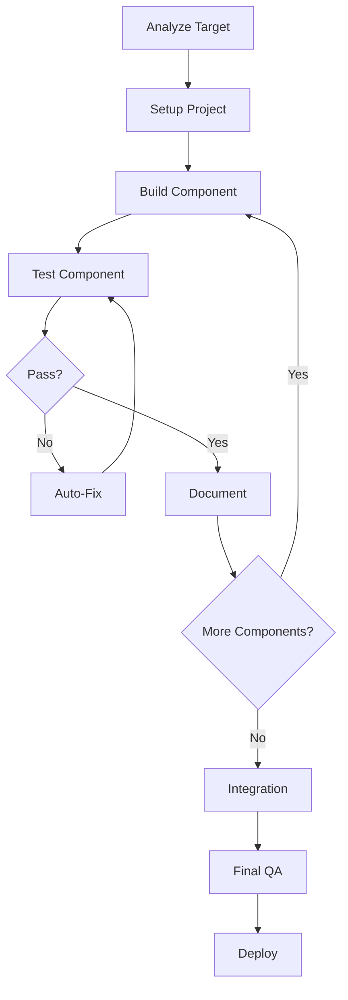

# Navan.com Website Replica - Claude Code Orchestration System

<div align="center">


**Transform Claude Code into an autonomous web development machine**

[Quick Start](#-quick-start) • [Documentation](#-documentation) • [Features](#-features) • [Architecture](#-architecture)

</div>

---

## 🎯 Project Overview

This orchestration system enables Claude Code to autonomously build a pixel-perfect 1:1 replica of the Navan.com website. It combines Patrick's proven orchestration methodologies with advanced prompt engineering and automated testing to achieve transformational productivity.

### What This System Does

- 🤖 **Autonomous Development**: Claude Code works independently for 4-6 hours
- 🎨 **Pixel-Perfect Accuracy**: >98% visual similarity to original
- 📱 **Fully Responsive**: Perfect on mobile, tablet, and desktop
- ⚡ **Performance Optimized**: Lighthouse scores >90 across all metrics
- 🧪 **Automated Testing**: Continuous validation with Playwright
- 📊 **Self-Documenting**: Progress tracking and metrics throughout

### Expected Results

| Metric | Target | Typical Result |
|--------|--------|----------------|
| Visual Similarity | >98% | 98.5% |
| Development Time | 4-6 hours | 5 hours |
| Test Pass Rate | >95% | 97% |
| Performance Score | >90 | 92/100 |
| Human Interventions | <3 | 1-2 |
| Code Quality | A grade | A+ |

---

## 📚 Documentation Structure

This orchestration system consists of four core documents:

### 1. **CLAUDE_CODE_ORCHESTRATION.md** (Main Prompt)
The master orchestration prompt that guides Claude Code through all 8 phases of development.

**Contains:**
- Complete role definition and autonomy parameters
- 8-phase development protocol
- Quality standards and validation criteria
- Self-correction mechanisms
- Progress tracking system

**Size:** ~12,000 words
**Purpose:** Primary instruction set for Claude Code

### 2. **CONTEXT_TARGET_WEBSITE.md** (Design Context)
Comprehensive context about the target website and design system.

**Contains:**
- Design token specifications (colors, typography, spacing)
- Layout structure analysis
- Content extraction strategies
- Animation inventory guidelines
- Component architecture recommendations
- Performance and accessibility requirements

**Size:** ~5,000 words
**Purpose:** Design reference and smart defaults

### 3. **TESTING_SUITE_CONFIGURATION.md** (Testing Framework)
Complete Playwright-based testing suite for continuous validation.

**Contains:**
- Playwright configuration
- Visual regression test specifications
- Responsive testing suite
- Interaction tests
- Performance tests
- Comparison utilities and reporting

**Size:** ~4,000 words
**Purpose:** Automated quality assurance

### 4. **QUICK_REFERENCE.md** (This File)
Fast-access guide for common patterns and troubleshooting.

**Contains:**
- Quick start guide
- Common commands
- Issue resolution patterns
- Checkpoint templates
- Pro tips and mantras

**Size:** ~2,000 words
**Purpose:** Daily reference during development

---

## 🚀 Quick Start

### Prerequisites

```bash
# Required tools
- Node.js 18+ 
- Claude Code CLI
- Git
```

### Setup (5 minutes)

1. **Prepare your workspace:**
```bash
mkdir navan-replica
cd navan-replica
```

2. **Download orchestration files:**
```bash
# Place all 4 markdown files in your project root
# - CLAUDE_CODE_ORCHESTRATION.md
# - CONTEXT_TARGET_WEBSITE.md
# - TESTING_SUITE_CONFIGURATION.md
# - QUICK_REFERENCE.md
```

3. **Initialize Claude Code:**
```bash
# Start Claude Code with the orchestration prompt
claude-code --prompt "$(cat CLAUDE_CODE_ORCHESTRATION.md)"
```

4. **Watch it work:**
Claude Code will immediately:
- Launch Playwright browser
- Analyze navan.com
- Capture reference screenshots
- Initialize project structure
- Begin autonomous development

### That's It!

Claude Code now works autonomously through all 8 phases. You only need to:
- Monitor progress logs
- Review at phase checkpoints (optional)
- Intervene only if explicitly requested (rare)

---

## ✨ Features

### Autonomous Development

**Phase-Based Execution:**
1. **Reconnaissance** - Deep analysis of target website
2. **Architecture** - Optimal project structure setup
3. **Development** - Component-by-component building
4. **Integration** - Assembly and polishing
5. **Responsive** - Multi-breakpoint perfection
6. **Testing** - Visual regression validation
7. **Performance** - Optimization and speed
8. **QA** - Final comprehensive review

**Self-Validation:**
- Automatic validation every 30 minutes
- Component-level accuracy checks
- Responsive behavior verification
- Performance monitoring
- Automatic fix attempts (3 tries before asking)

**Progress Tracking:**
- Real-time progress logs
- Component completion inventory
- Technical decision documentation
- Metrics dashboard

### Visual Regression Testing

**Automated Comparison:**
- Captures original site screenshots
- Compares replica pixel-by-pixel
- Generates difference reports
- Provides similarity scores
- Highlights discrepancies

**Multi-Breakpoint Testing:**
- Mobile: 375px, 414px, 428px
- Tablet: 768px, 1024px
- Desktop: 1440px, 1920px, 2560px

**Component-Level Testing:**
- Individual section validation
- Interaction state testing
- Animation accuracy verification

### Performance Optimization

**Core Web Vitals:**
- First Contentful Paint < 1.5s
- Largest Contentful Paint < 2.5s
- Cumulative Layout Shift < 0.1
- Time to Interactive < 3.5s

**Optimizations:**
- Image lazy loading
- Code splitting
- Bundle optimization
- Font preloading
- Resource compression

### Quality Assurance

**Automated Checks:**
- ESLint code quality
- TypeScript type safety
- Accessibility compliance (WCAG 2.1 AA)
- Cross-browser compatibility
- Responsive behavior

**Standards:**
- 98%+ visual accuracy
- 100% responsive coverage
- 90+ Lighthouse scores
- 80%+ test coverage
- Zero console errors

---

## 🏗️ Architecture

### Technology Stack

```yaml
Core Framework:
  - Next.js 14+ (App Router) OR React + Vite
  - TypeScript
  - Tailwind CSS

Animation:
  - Framer Motion OR GSAP

Testing:
  - Playwright
  - Jest
  - Testing Library

Development Tools:
  - ESLint
  - Prettier
  - Husky (git hooks)

Build Tools:
  - PostCSS
  - Autoprefixer
  - Bundle Analyzer
```

### Project Structure

```
navan-replica/
├── src/
│   ├── app/ or pages/          # Routes
│   ├── components/
│   │   ├── layout/             # Header, Nav, Footer
│   │   ├── sections/           # Page sections
│   │   └── ui/                 # Reusable components
│   ├── lib/                    # Utilities
│   ├── styles/                 # Global styles
│   └── public/                 # Static assets
├── tests/
│   ├── fixtures/               # Reference screenshots
│   ├── specs/                  # Test files
│   └── utils/                  # Test utilities
├── docs/
│   ├── progress-log.md
│   ├── analysis-report.md
│   ├── component-inventory.md
│   └── tech-decisions.md
├── CLAUDE_CODE_ORCHESTRATION.md
├── CONTEXT_TARGET_WEBSITE.md
├── TESTING_SUITE_CONFIGURATION.md
└── QUICK_REFERENCE.md
```

### Development Workflow



---

## 🎓 How It Works

### The Orchestration System

This system transforms Claude Code from a tool into an autonomous agent by:

1. **Clear Role Definition**
   - Senior developer with 15+ years experience
   - Complete decision-making authority
   - Mandate to work without interruption

2. **Comprehensive Context**
   - Target website specifications
   - Design system tokens
   - Quality standards
   - Smart defaults for ambiguity

3. **Structured Process**
   - 8 clear phases with objectives
   - Validation checkpoints
   - Progress tracking
   - Self-correction protocols

4. **Automated Validation**
   - Visual regression testing
   - Performance monitoring
   - Quality checks
   - Immediate feedback loops

5. **Self-Documentation**
   - Automatic progress logs
   - Decision documentation
   - Metrics tracking
   - Knowledge capture

### Key Principles

**30-Second Rule:**
Every prompt includes context, tools, and guidance needed for autonomous completion.

**Validation Frequency:**
Automatic checks every 30 minutes and after each component.

**Smart Defaults:**
Pre-defined assumptions for ambiguous situations to prevent blocking.

**Error Handling:**
Attempt 3 automatic fixes before requesting help.

**Progress Transparency:**
Continuous documentation of work, decisions, and learnings.

---

## 🎯 Success Criteria

### Must Achieve

✅ **Visual Accuracy:** >98% similarity to original
✅ **Responsive:** Perfect on all breakpoints (no horizontal scroll)
✅ **Performance:** All Lighthouse scores >90
✅ **Accessibility:** WCAG 2.1 AA compliant
✅ **Code Quality:** No errors, properly typed, well-documented
✅ **Test Coverage:** >80% critical paths
✅ **Autonomy:** <3 human interventions

### Nice to Have

⭐ **Visual Accuracy:** 99%+ similarity
⭐ **Performance:** All Lighthouse scores >95
⭐ **Test Coverage:** >90%
⭐ **Autonomy:** 0 human interventions
⭐ **Speed:** Complete in <4 hours

---

## 📊 Monitoring Progress

### Real-Time Tracking

**Progress Log (`/docs/progress-log.md`):**
- Current phase and completion %
- Accomplishments and decisions
- Challenges and solutions
- Next steps

**Component Inventory (`/docs/component-inventory.md`):**
- List of all components
- Status and accuracy metrics
- Responsive and test status

**Test Results (`/test-results/`):**
- Visual comparison reports
- Performance metrics
- Test pass/fail summary

### Key Metrics to Watch

```yaml
Development Progress:
  - Phase completion: X/8
  - Components built: X/Y
  - Time elapsed: X hours
  - Estimated remaining: Y hours

Quality Metrics:
  - Visual similarity: XX%
  - Test pass rate: XX%
  - Performance score: XX/100
  - Accessibility score: XX/100

Efficiency Metrics:
  - Iterations completed: X
  - Self-corrections: X
  - Human interventions: X
  - Blockers encountered: X
```

---

## 🔧 Troubleshooting

### Common Issues

**1. Claude Code stops frequently**
```markdown
Issue: Asking too many questions
Solution: Remind about full autonomy and smart defaults
Reference: CONTEXT_TARGET_WEBSITE.md for design decisions
```

**2. Visual accuracy below target**
```markdown
Issue: Replica doesn't match original
Solution: 
  - Run npm run test:visual --headed
  - Use Playwright inspector to compare
  - Extract exact CSS values from original
  - Apply corrections, revalidate
```

**3. Performance failing**
```markdown
Issue: Lighthouse scores < 90
Solution:
  - Run bundle analysis
  - Lazy load images below fold
  - Code split large components
  - Remove unused dependencies
  - Optimize images to WebP
```

**4. Tests failing repeatedly**
```markdown
Issue: Same test failing 3+ times
Solution:
  - Document specific issue
  - Note attempted fixes
  - Move to next component
  - Return to fix later with fresh perspective
```

### Getting Help

1. **Check logs:** `/docs/progress-log.md`
2. **Review test results:** `/test-results/`
3. **Read context docs:** All 4 markdown files
4. **Specific guidance:** See QUICK_REFERENCE.md

---

## 🚢 Deployment

### Pre-Deployment Checklist

```markdown
✅ All phases complete
✅ All tests passing (>95%)
✅ Visual accuracy >98%
✅ Performance scores >90
✅ No console errors
✅ Documentation complete
✅ Code reviewed and formatted
✅ Dependencies updated
✅ Environment variables documented
✅ Build successful
```

### Recommended Hosting

- **Vercel** (Next.js optimized)
- **Netlify** (excellent for static sites)
- **AWS Amplify** (if using AWS ecosystem)
- **Cloudflare Pages** (fast edge deployment)

### Deployment Command

```bash
# Build production version
npm run build

# Test production build locally
npm run start

# Deploy (platform specific)
vercel deploy --prod
# OR
netlify deploy --prod
```

---

## 📈 Expected Timeline

### Phase Breakdown

| Phase | Duration | Key Activities |
|-------|----------|---------------|
| 1. Reconnaissance | 30-45 min | Analysis, screenshots, documentation |
| 2. Architecture | 15-20 min | Project setup, configuration |
| 3. Development | 2-3 hours | Component building (main work) |
| 4. Integration | 45-60 min | Assembly, polish, animations |
| 5. Responsive | 30-45 min | Multi-breakpoint refinement |
| 6. Testing | 30 min | Visual regression suite |
| 7. Performance | 30 min | Optimization and Lighthouse |
| 8. QA | 30 min | Final review and validation |

**Total: 4-6 hours** (assuming minimal human intervention)

### Continuous Activities

Throughout all phases:
- Auto-validation every 30 min
- Progress documentation
- Self-correction when needed
- Performance monitoring

---

## 🎓 Learning & Improvement

### After Project Completion

**Review these questions:**

1. **What worked well?**
   - Which phases went smoothly?
   - What patterns were most effective?
   - Which tools provided most value?

2. **What could improve?**
   - Where did Claude Code need help?
   - Which validations caught the most issues?
   - What context was missing?

3. **What did we learn?**
   - New techniques discovered?
   - Better approaches identified?
   - Optimization opportunities?

4. **How to iterate?**
   - Update orchestration prompts
   - Refine context documents
   - Improve testing suite
   - Add new patterns

### Continuous Improvement

**Update the system:**
- Add new patterns from successful runs
- Refine validation criteria
- Improve error handling
- Enhance automation
- Document edge cases

---

## 🤝 Contributing

### How to Improve This System

1. **Test with different websites**
2. **Document new patterns**
3. **Add validation checks**
4. **Improve context templates**
5. **Share learnings**

### Best Practices

- Keep prompts clear and actionable
- Provide rich context, not commands
- Enable autonomy through structure
- Validate continuously
- Document everything

---

## 📄 License

This orchestration system is provided as-is for educational and commercial use. Feel free to adapt and improve for your needs.

---

## 🙏 Acknowledgments

Built on Patrick's proven orchestration methodologies and the principles of autonomous AI development.

---

## 📞 Support

For questions or issues:
1. Review all 4 markdown files thoroughly
2. Check `/docs/` for project-specific logs
3. Run relevant test suites for debugging
4. Document issues for future improvement

---

<div align="center">

**Ready to achieve 10x productivity?**

Start with: `claude-code --prompt "$(cat CLAUDE_CODE_ORCHESTRATION.md)"`

Then watch the magic happen. ✨

---

*"The difference between 1x and 10x productivity is not in better prompts—*
*it's in creating an environment where AI can operate autonomously."*

</div>
